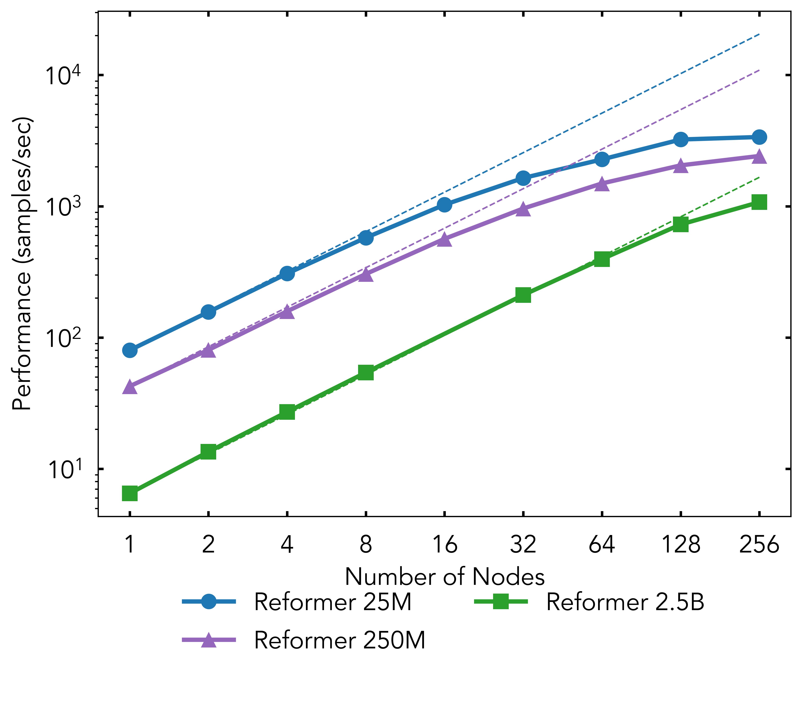
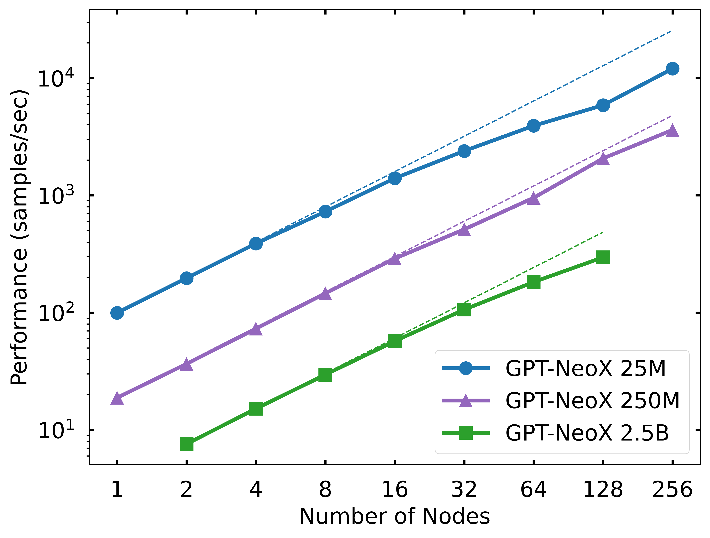

# Experiments

Models: Reformer, GPT-2, GPT-NeoX

We need to test the following for each model:
 - How does training strong scaling look for these as we compute the cross product of:
    - Scale number of params: (25M, 250M, 2.5B, 20B)
    - Scale number of nodes: (1, 2, 4, 8, 16, 32, 64, 128, 256)
    - Genome-scale vs Protein-scale block size: (512, 10240)
 - Same as above for inference/generation scaling.

Note: Many of these experiments will not fit into memory.
Total possible experiments: 3 models * 4 params * 9 nodes * 2 blockSizes = 216

# Organization

- Model architecture JSON files are stored in `architectures/`.
- Performance results for different models stored in `results/`.
- To generate a configuration file for each experiment, run: `generate_configs.py`.
- Figures stored in `figures/` and produced by `perf_scaling.ipynb`.

# Results

Experiments were performed using a sequence length of 2048.

Reformer experiment run on [Perlmutter](https://www.nersc.gov/systems/perlmutter/) at [NERSC](https://www.nersc.gov/).

GPT-NeoX experiment run on [Polaris](https://www.alcf.anl.gov/polaris) at [ALCF](https://www.alcf.anl.gov/).

Combined plot:

